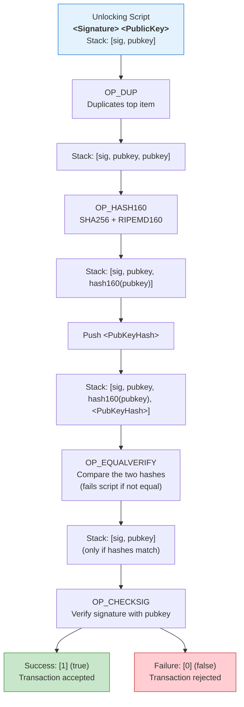

# Bitcoin Scripting Assignment - Assignment A

## Given Script

This is the standard **P2PKH (Pay-to-Public-Key-Hash)** locking script used in most Bitcoin addresses.

## 1. Break down each opcode's purpose

- **OP_DUP**: Duplicates the top item on the stack (the Public Key). This is needed because we need the original Public Key later for signature verification.
- **OP_HASH160**: Takes the duplicated Public Key, computes SHA256 followed by RIPEMD-160, producing a 20-byte hash.
- **<PubKeyHash>**: Pushes the 20-byte hash that was embedded when the output was created (the recipient's address hash).
- **OP_EQUALVERIFY**: Compares the computed hash with the stored <PubKeyHash>. If they do **not** match, the script fails immediately.
- **OP_CHECKSIG**: Verifies that the provided signature is valid for the Public Key. Pushes `1` (true) on success or `0` (false) on failure.

## 2. Data Flow Diagram (Stack Execution)

## 3. What happens if signature verification fails?

- OP_CHECKSIG pushes 0 (false) onto the stack.
- The entire script evaluates to false.
- The Bitcoin node rejects the transaction — the output cannot be spent.
  Funds stay locked forever (or until another valid spend is found).

## 4. Security benefits of hash verification

- The real public key is never stored on-chain in the locking script (only its 20-byte hash).
- This gives smaller addresses (P2PKH addresses are shorter) and better privacy — the pubkey is only revealed when someone actually spends the output.
- It protects against certain quantum attacks (hash is harder to reverse than a raw pubkey) and makes address reuse safer.
- OP_EQUALVERIFY + OP_CHECKSIG together guarantee only the owner of the private key can spend it.
